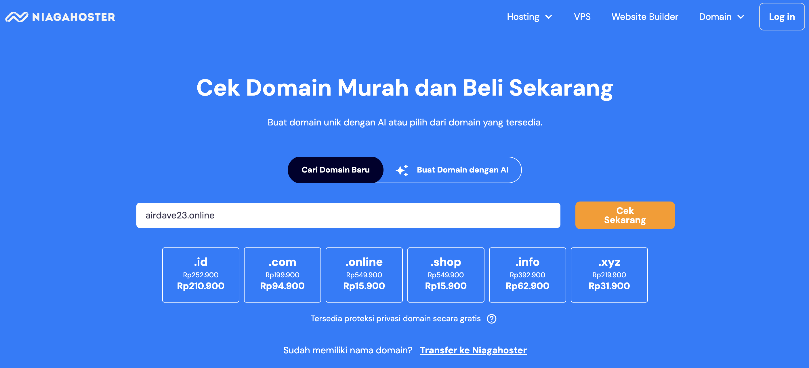
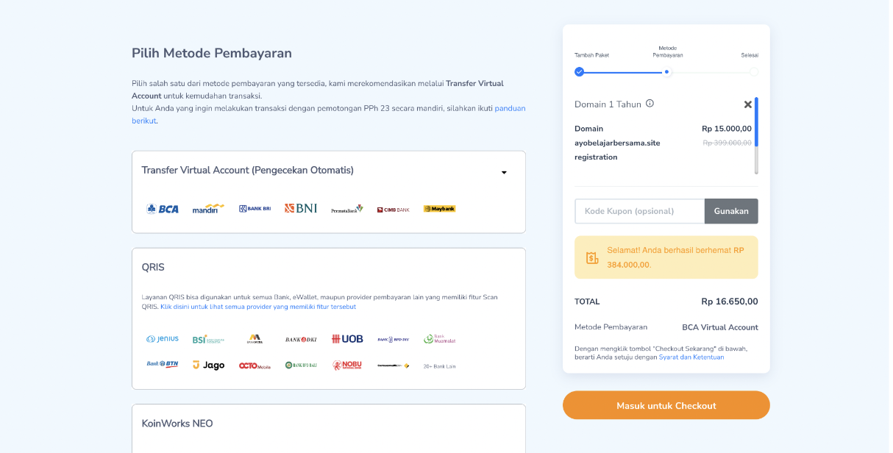
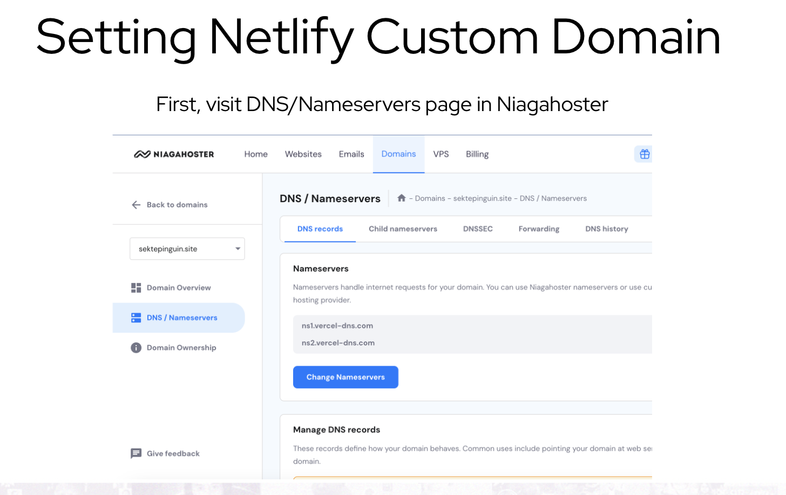
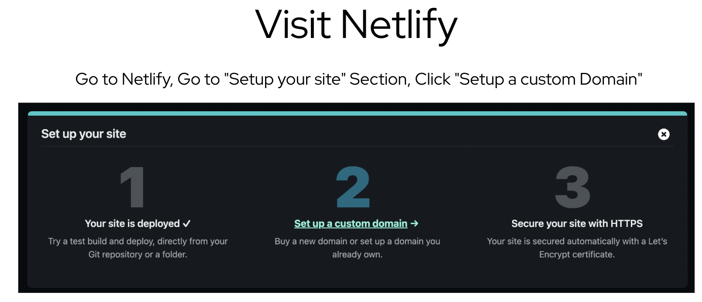
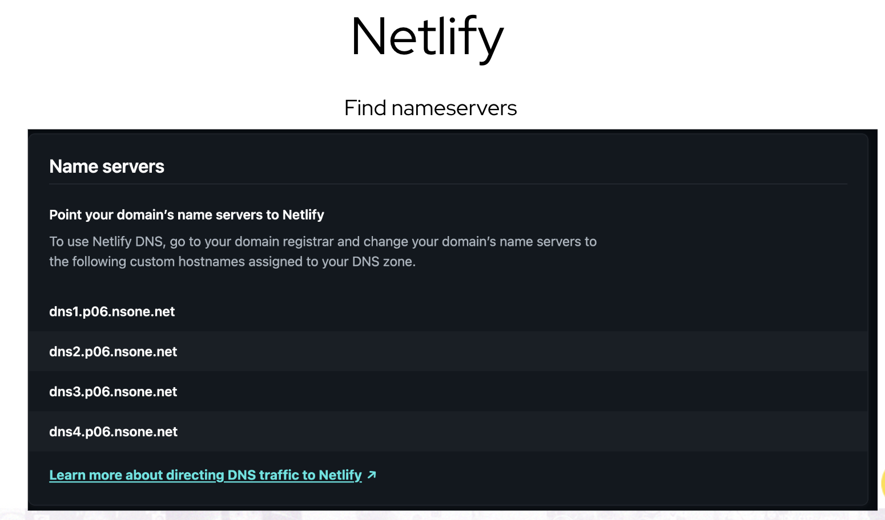
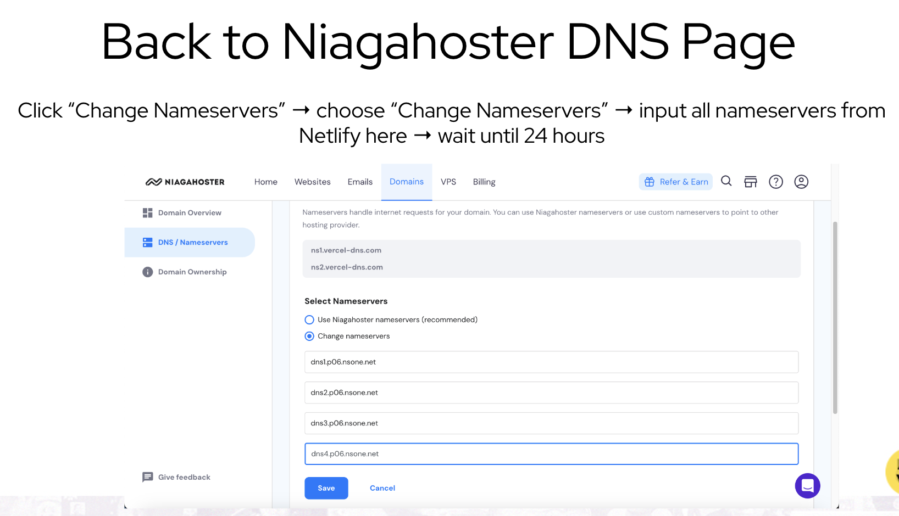

# Hello all
This is my first checkpoint assignment about html.

## Here is the website
My Website https://airdave23.online/

## This is me about 10 years ago

### Here are steps I make for hosting my website to the domain registrar I choose (niagahoster.com)

- Buy a domain in Niagahoster
  
  

- Check availability of your domain

    

- Finish the payment
  

- Setting domain name from Netlify
    
    
    

- Summary of the setting 
  

  